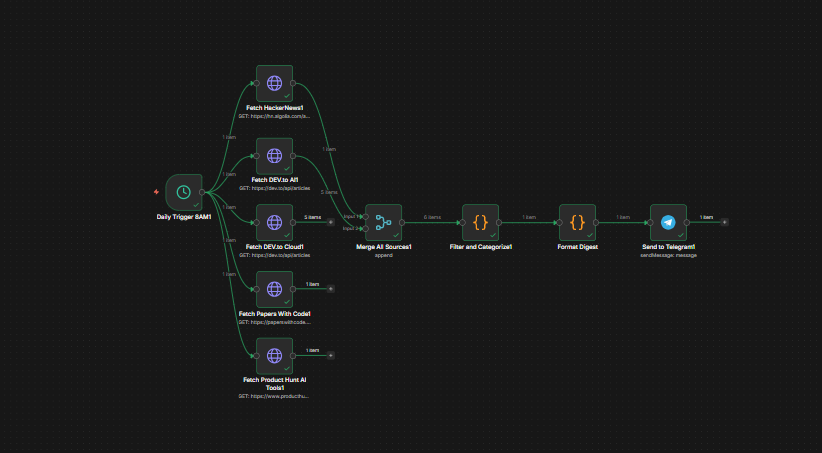
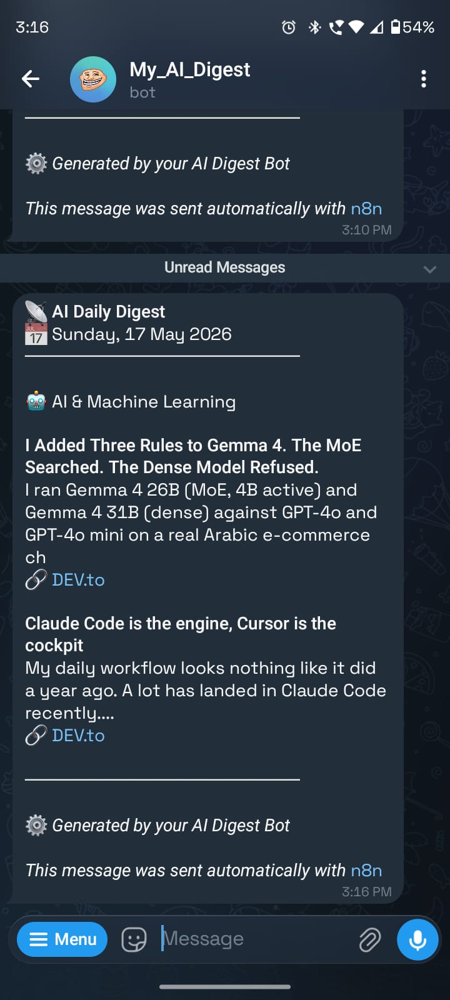

# AI Daily Digest Bot

> A self-hosted personal AI agent built with **n8n** that automatically fetches, filters, and delivers daily tech news to **Telegram** every morning — focused on AI/ML, Cloud, Web Dev, and AI Tools.

---

## Project Screenshots

### n8n Workflow


### Telegram Output


---

## What This Bot Does

Every day at **8AM automatically**:

- Fetches latest articles from **5 sources**
- Filters and categorizes content into 4 domains
- Formats a clean digest with titles, descriptions, and links
- Sends it directly to your **personal Telegram**

Zero manual work after setup.

---

## Content Categories

| Category | Sources |
|---|---|
| AI & Machine Learning | HackerNews, DEV.to, Papers With Code |
| Cloud & DevOps | HackerNews, DEV.to Cloud |
| AI Tools | Product Hunt, HackerNews |
| Web Development | DEV.to, HackerNews |

---

## Tech Stack

| Tool | Purpose | Cost |
|---|---|---|
| **n8n** | Workflow automation (self-hosted via Docker) | Free |
| **Telegram Bot API** | Message delivery | Free |
| **HackerNews Algolia API** | Tech news source | Free, no key |
| **DEV.to API** | Developer articles | Free, no key |
| **Papers With Code API** | ML research papers | Free, no key |
| **Product Hunt RSS** | AI tools discovery | Free, no key |

**Total Cost: $0/month**

---

## 🔧 Workflow Architecture

```
Daily Trigger (8AM)
        │
        ├──► Fetch HackerNews
        ├──► Fetch DEV.to AI
        ├──► Fetch DEV.to Cloud
        ├──► Fetch Papers With Code
        └──► Fetch Product Hunt AI Tools
                        │
                        ▼
               Merge All Sources
                        │
                        ▼
            Filter and Categorize
            (keyword scoring, dedup)
                        │
                        ▼
               Format Digest
            (Telegram HTML format)
                        │
                        ▼
             Send to Telegram
```

---

## Setup Instructions

### Prerequisites

- Docker installed on your machine
- n8n running via Docker
- Telegram account

---

### Step 1 — Run n8n via Docker

```bash
docker run -it --rm \
  --name n8n \
  -p 5678:5678 \
  -v ~/.n8n:/home/node/.n8n \
  n8nio/n8n
```

Open `http://localhost:5678` in your browser.

---

### Step 2 — Create Telegram Bot

1. Open Telegram → search **@BotFather**
2. Send `/newbot` → follow instructions
3. Copy the **Bot Token**
4. Send `/start` to your new bot
5. Get your **Chat ID** from:
```
https://api.telegram.org/botYOUR_TOKEN/getUpdates
```

---

### Step 3 — Import Workflow

1. In n8n → **New Workflow** → **Import from File**
2. Upload `workflow.json`
3. All nodes will appear automatically

---

### Step 4 — Configure Telegram Credential

1. n8n → **Settings** → **Credentials** → **Add Credential**
2. Search **"Telegram"**
3. Paste your **Bot Token**
4. Save as `"Telegram Bot"`

---

### Step 5 — Update Chat ID

1. Open **"Send to Telegram"** node
2. Set **Resource** → `Message`
3. Set **Operation** → `Send Message`
4. Set **Chat ID** → your actual Chat ID number
5. Set **Text** → `={{ $json.message }}`
6. Set **Parse Mode** → `HTML`

---

### Step 6 — Publish and Activate

1. Click **"Publish"** button (top right)
2. Bot is now live — runs automatically at 8AM daily

---

## Sample Telegram Output

```
📡 AI Daily Digest
📅 Sunday, 17 May 2026
──────────────────────

🤖 AI & Machine Learning

Claude Code is the engine, Cursor is the cockpit
My daily workflow looks nothing like it did a year ago...
🔗 DEV.to

I Added Three Rules to Gemma 4. The MoE Searched.
I ran Gemma 4 26B (MoE, 4B active) against GPT-4o...
🔗 DEV.to

──────────────────────

☁️ Cloud & DevOps

[articles with links]

──────────────────────
⚙️ Generated by your AI Digest Bot
```

---

## Important Notes

**For the bot to run automatically:**
- Laptop must be **ON at 8AM**
- Docker must be **running**
- Internet must be **connected**

**After laptop restart, run:**
```bash
docker start n8n
```

---

## Security

Before pushing to a public repository:
- Remove your actual **Telegram Bot Token**
- Remove your actual **Chat ID**
- Remove any **API keys**

Replace them with placeholders like `YOUR_TELEGRAM_TOKEN` and `YOUR_CHAT_ID`.

---

## Repository Structure

```
ai-daily-digest-bot/
├── README.md
├── workflow.json
└── images/
    ├── workflow.png
    └── telegram_output.jpeg
```

---

## Author

**SriSaiKiran**
Built with n8n, Telegram Bot API, and free public APIs.

---

## License

MIT License — free to use, modify, and distribute.
